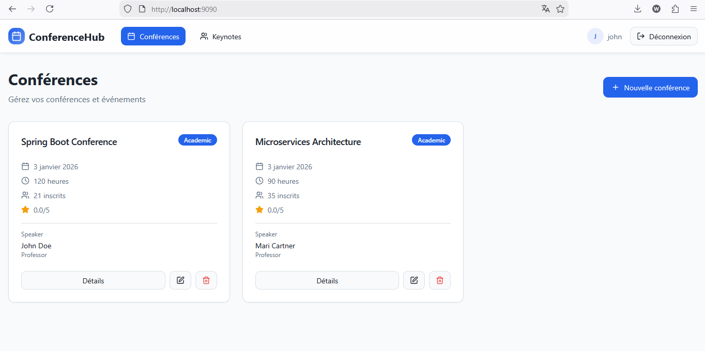
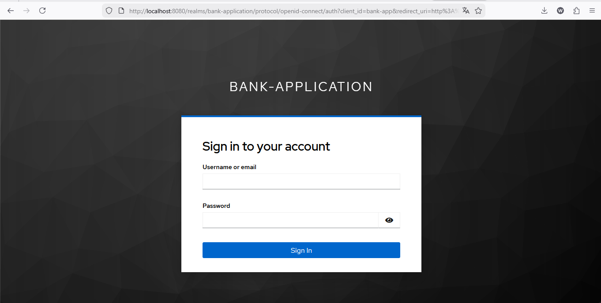
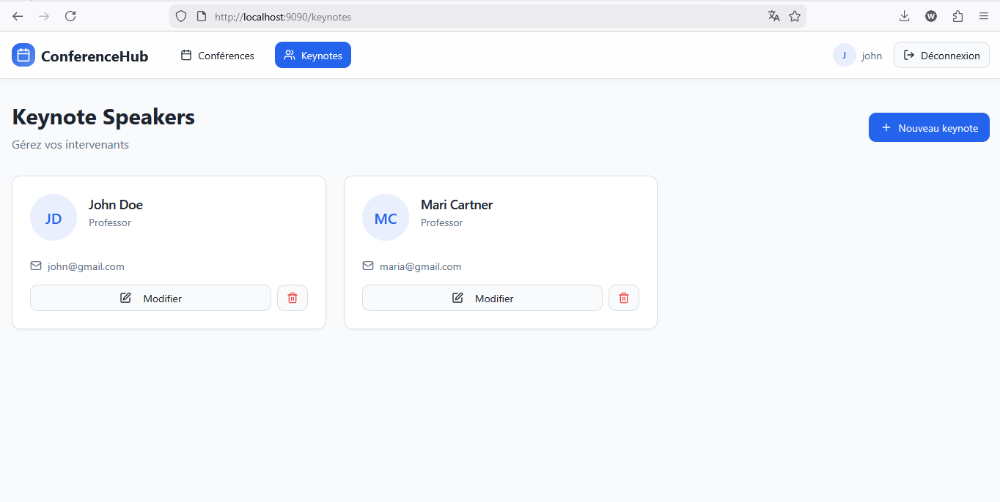
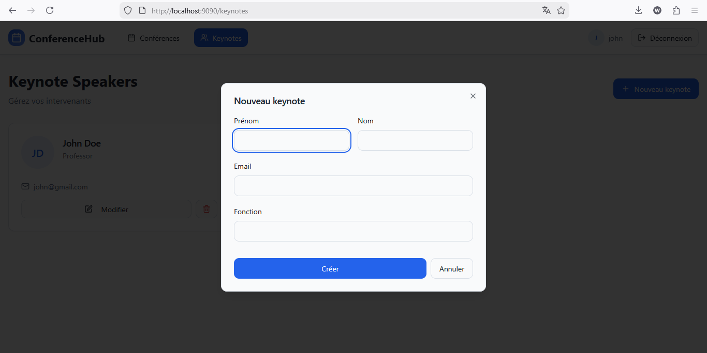
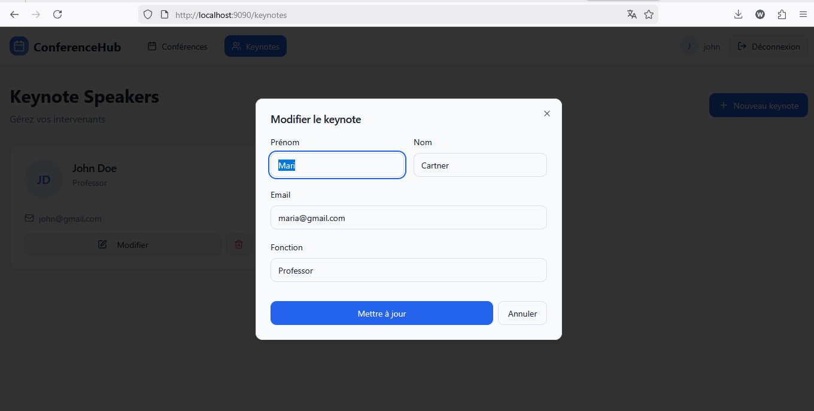
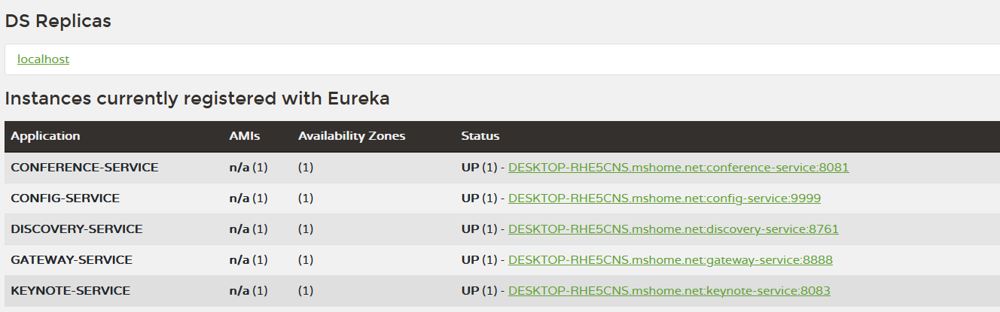

# Système de Gestion des Conférences - Conference Management Application

## 📋 Table des matières

- [Vue d'ensemble](#vue-densemble)
- [Architecture du Système](#architecture-du-système)
- [Technologies Utilisées](#technologies-utilisées)
- [Microservices](#microservices)
  - [Microservice Conference](#microservice-conference)
  - [Microservice Keynote](#microservice-keynote)
- [Diagramme de Classes](#diagramme-de-classes)
- [Interface Utilisateur](#interface-utilisateur)
- [Services Infrastrukture](#services-infrastrukture)
- [Installation et Déploiement](#installation-et-déploiement)
- [Documentation des API](#documentation-des-api)

---

##  Vue d'ensemble

Cette application est un système de gestion de conférences construit avec une **architecture microservices**. Elle permet de :

- **Créer et gérer des conférences** : ajouter, modifier, supprimer et lister les conférences
- **Gérer les keynotes** : créer et gérer les keynotes (présentations principales)
- **Évaluer les conférences** : laisser des avis et des notes sur les conférences
- **Authentification sécurisée** : intégration avec Keycloak pour l'authentification

### Caractéristiques principales

 Architecture microservices décentralisée  
 API REST complètes  
 Base de données PostgreSQL  
 Authentification OAuth2/OIDC avec Keycloak  
 Service Discovery avec Eureka  
 API Gateway pour le routage  
 Interface utilisateur moderne (React + TypeScript)  
 Déploiement containerisé avec Docker

---

##  Architecture du Système

```
┌─────────────────────────────────────────────────────────┐
│                   Client (React/TypeScript)              │
│              (Vite + Tailwind CSS + ShadcnUI)            │
└────────────┬────────────────────────────────────┬────────┘
             │                                    │
             │         API Gateway Service        │
             │      (Routage & Orchestration)     │
             │                                    │
    ┌────────▼─────────────┬──────────────────────▼────────┐
    │                      │                               │
┌───▼─────────────────┐  ┌▼──────────────────────────────┐ │
│ Conference Service  │  │   Keynote Service             │ │
│ (Port: 8081)        │  │   (Port: 8082)                │ │
│                     │  │                                │ │
│ ├─ Controller       │  │ ├─ Controller                 │ │
│ ├─ Service          │  │ ├─ Service                    │ │
│ ├─ Repository       │  │ ├─ Repository                 │ │
│ └─ Entity           │  │ └─ Entity                      │ │
│                     │  │                                │ │
│ Database: PostgreSQL│  │ Database: PostgreSQL           │ │
└─────────────────────┘  └────────────────────────────────┘ │
                                                             │
    ┌────────────────────────────────────────────────────┐  │
    │  Config Server + Discovery Service (Eureka)        │  │
    └────────────────────────────────────────────────────┘  │
    ┌────────────────────────────────────────────────────┐  │
    │  Keycloak (Authentification OAuth2/OIDC)           │  │
    └────────────────────────────────────────────────────┘  │
```

---

## 🛠️ Technologies Utilisées

### Backend
- **Framework** : Spring Boot 3.5.6
- **Java** : Version 17
- **Spring Cloud** : 2025.0.0
- **Gestion de données** : Spring Data JPA
- **Base de données** : PostgreSQL
- **Authentification** : Spring Security + Keycloak
- **Service Discovery** : Spring Cloud Eureka
- **API Gateway** : Spring Cloud Gateway

### Frontend
- **Framework** : React 18+
- **Langage** : TypeScript
- **Build Tool** : Vite
- **Styling** : Tailwind CSS
- **UI Components** : ShadcnUI
- **Client HTTP** : Axios
- **Authentication** : Keycloak JS Adapter

### Infrastructure
- **Containerization** : Docker
- **Orchestration** : Docker Compose
- **Web Server** : Nginx (pour le frontend)

---

## 🔧 Microservices

### Microservice Conference

Le **Microservice Conference** est responsable de la gestion complète des conférences et des évaluations.

####  Entités principales

```
┌─────────────────────────────────────────┐
│ Entity: Conference                       │
├─────────────────────────────────────────┤
│ - id: Long                              │
│ - titre: String                         │
│ - type: TypeConference (enum)           │
│ - date: Date                            │
│ - duree: Double                         │
│ - nombreInscrits: Integer               │
│ - score: Double                         │
│ - keynoteId: Long (FK)                  │
│ - reviews: List<Review>                 │
│ - keynote: Keynote (@Transient)         │
└─────────────────────────────────────────┘
           │
           ├─► OneToMany avec Review
           │
           └─► Association avec Keynote
               (via keynoteId)

┌─────────────────────────────────────────┐
│ Entity: Review                           │
├─────────────────────────────────────────┤
│ - id: Long                              │
│ - contenu: String                       │
│ - score: Double                         │
│ - conference: Conference (FK)           │
└─────────────────────────────────────────┘

┌─────────────────────────────────────────┐
│ Enum: TypeConference                    │
├─────────────────────────────────────────┤
│ - TECHNIQUE                             │
│ - METIER                                │
│ - FORMATION                             │
│ - ATELIER                               │
└─────────────────────────────────────────┘
```

####  API Endpoints

| Méthode | Endpoint | Description |
|---------|----------|-------------|
| GET | `/api/conferences` | Récupérer toutes les conférences |
| GET | `/api/conferences/{id}` | Récupérer une conférence par ID |
| POST | `/api/conferences` | Créer une nouvelle conférence |
| PUT | `/api/conferences/{id}` | Mettre à jour une conférence |
| DELETE | `/api/conferences/{id}` | Supprimer une conférence |
| POST | `/api/conferences/{id}/reviews` | Ajouter un avis |
| GET | `/api/conferences/{id}/reviews` | Récupérer les avis |

####  Structure des packages

```
org.example.conferenceservice/
├── entity/
│   ├── Conference.java
│   ├── Review.java
│   └── TypeConference.java
├── dto/
│   ├── ConferenceRequestDTO.java
│   ├── ConferenceResponseDTO.java
│   ├── ReviewRequestDTO.java
│   └── ReviewResponseDTO.java
├── repository/
│   ├── ConferenceRepository.java
│   └── ReviewRepository.java
├── service/
│   ├── IConferenceService.java
│   └── IConferenceServiceImpl.java
├── mapper/
│   ├── ConferenceMapper.java
│   └── ReviewMapper.java
├── web/
│   ├── ConferenceController.java
│   └── KeynoteClient.java (Communication inter-services)
├── config/
│   └── SecurityConfig.java
├── mcp/
│   └── ConferenceTools.java
└── ConferenceServiceApplication.java
```

####  Interaction avec Keynote Service

Le **Conference Service** communique avec le **Keynote Service** via :
- **KeynoteClient** : Client Feign pour les appels REST
- **keynoteId** : Référence à une keynote
- **@Transient keynote** : Objet Keynote chargé dynamiquement

---

### Microservice Keynote

Le **Microservice Keynote** gère les keynotes (présentations principales des conférences).

####  Entités principales

```
┌─────────────────────────────────────────┐
│ Entity: Keynote                         │
├─────────────────────────────────────────┤
│ - id: Long                              │
│ - nom: String                           │
│ - prenom: String                        │
│ - email: String                         │
│ - fonction: String                      │
└─────────────────────────────────────────┘
```

####  API Endpoints

| Méthode | Endpoint | Description |
|---------|----------|-------------|
| GET | `/api/keynotes` | Récupérer toutes les keynotes |
| GET | `/api/keynotes/{id}` | Récupérer une keynote par ID |
| POST | `/api/keynotes` | Créer une nouvelle keynote |
| PUT | `/api/keynotes/{id}` | Mettre à jour une keynote |
| DELETE | `/api/keynotes/{id}` | Supprimer une keynote |

####  Structure des packages

```
org.example.keynoteservice/
├── entity/
│   └── Keynote.java
├── dto/
│   ├── KeynoteRequestDTO.java
│   └── KeynoteResponseDTO.java
├── repository/
│   └── KeynoteRepository.java
├── service/
│   ├── IKeynoteService.java
│   └── IKeynoteServiceImpl.java
├── mapper/
│   └── KeynoteMapper.java
├── web/
│   └── KeynoteController.java
├── config/
│   ├── SecurityConfig.java
│   └── JwtAuthConverter.java
├── mcp/
│   └── KeynoteTools.java
└── KeynoteServiceApplication.java
```

---

##  Diagramme de Classes

### Architecture Microservices avec Associations

```
┌─────────────────────────────────────────────────┐
│   Conference Microservice                       │
├─────────────────────────────────────────────────┤
│                                                 │
│  ┌──────────────────────────────────────────┐  │
│  │ Conference                               │  │
│  ├──────────────────────────────────────────┤  │
│  │ - id: Long                               │  │
│  │ - titre: String                          │  │
│  │ - type: TypeConference                   │  │
│  │ - date: Date                             │  │
│  │ - duree: Double                          │  │
│  │ - nombreInscrits: Integer                │  │
│  │ - score: Double                          │  │
│  │ - keynoteId: Long                        │──┼──────┐
│  │ - reviews: List<Review>                  │  │      │
│  │ - keynote: Keynote                       │  │      │
│  └──────────────────────────────────────────┘  │      │
│           │                                     │      │
│           │ 1                                   │      │
│           ├──► * Review                         │      │
│           │  ├── id: Long                       │      │
│           │  ├── contenu: String                │      │
│           │  └── score: Double                  │      │
│           │                                     │      │
└───────────┼─────────────────────────────────────┘      │
            │                                             │
            │  Association 1 --> * (Foreign Key)         │
            │                                             │
┌───────────▼─────────────────────────────────────┐      │
│   Keynote Microservice                          │      │
├─────────────────────────────────────────────────┤      │
│                                                 │      │
│  ┌──────────────────────────────────────────┐  │      │
│  │ Keynote                                  │  │      │
│  ├──────────────────────────────────────────┤  │      │
│  │ - id: Long                               │◄─┼──────┘
│  │ - nom: String                            │  │
│  │ - prenom: String                         │  │
│  │ - email: String                          │  │
│  │ - fonction: String                       │  │
│  └──────────────────────────────────────────┘  │
│                                                 │
└─────────────────────────────────────────────────┘
```

**Relation** : Une Conference est associée à une Keynote via `keynoteId`. Une Keynote peut être liée à une ou plusieurs Conferences.

---

##  Interface Utilisateur

L'application client offre une interface moderne et intuitive pour interagir avec le système.

### Page d'accueil



La page d'accueil affiche :
- Liste des conférences disponibles
- Vue en cartes pour chaque conférence
- Navigation vers les détails et les keynotes

### Authentification Keycloak



L'authentification sécurisée est gérée par Keycloak avec :
- OAuth2 / OpenID Connect
- Gestion centralisée des utilisateurs
- SSO (Single Sign-On)

### Page des Keynotes



Affiche :
- Liste de toutes les keynotes
- Informations détaillées sur les présentateurs
- Fonction et email des présentateurs

### Ajouter une Keynote



Formulaire pour :
- Ajouter une nouvelle keynote
- Saisir les informations du présentateur
- Validation des données

### Modifier une Keynote



Interface pour :
- Mettre à jour les informations d'une keynote
- Modifier les données du présentateur
- Confirmation des modifications

### Eureka - Service Discovery



Tableau de bord Eureka montrant :
- Tous les microservices enregistrés
- État de santé des services
- Instances actives
- Configuration du cluster

---

##  Services Infrastructure

### 1. **Discovery Service (Eureka)**
- **Port** : 8761
- **Rôle** : Enregistrement et découverte des microservices
- **Configuration** : Config Server
- Permet aux services de se découvrir automatiquement

### 2. **Config Server**
- **Rôle** : Gestion centralisée de la configuration
- **Sources** : `config-repository/`
  - `application.properties`
  - `conference-service.properties`
  - `keynote-service.properties`
- Permet la configuration externalisée et dynamique

### 3. **API Gateway**
- **Rôle** : Point d'entrée unique
- Routage des requêtes vers les microservices
- Gestion des requêtes CORS
- Intégration avec l'authentification

### 4. **Keycloak - Serveur d'Authentification**
- **Rôle** : Authentification et autorisation centralisées
- **Protocoles** : OAuth2, OpenID Connect
- Gestion des utilisateurs et des rôles
- SSO (Single Sign-On)

### 5. **PostgreSQL - Base de Données**
- **Rôles** :
  - Base de données Conference Service
  - Base de données Keynote Service
  - Persistance des données

---

##  Installation et Déploiement

### Prérequis

- Docker & Docker Compose
- Node.js (v18+) et npm/bun
- Java 17+
- Maven 3.8+

### Démarrage de l'Application

#### Avec Docker Compose

```bash
# À la racine du projet
docker-compose up -d

# Arrêter l'application
docker-compose down
```

#### Localement (Développement)

**Services Backend** :

```bash
# 1. Config Server
cd config-service
mvn spring-boot:run

# 2. Discovery Service (Eureka)
cd discovery-service
mvn spring-boot:run

# 3. Keynote Service
cd keynote-service
mvn spring-boot:run

# 4. Conference Service
cd conference-service
mvn spring-boot:run

# 5. Gateway Service
cd gateway-service
mvn spring-boot:run
```

**Client Frontend** :

```bash
cd client
bun install  # ou npm install
bun run dev # ou npm run dev
```

### Accès aux Services

| Service | URL | Description |
|---------|-----|-------------|
| Client | http://localhost:5173 | Application React |
| API Gateway | http://localhost:8080 | Point d'entrée API |
| Eureka | http://localhost:8761 | Service Discovery |
| Keycloak | http://localhost:8080/auth | Authentification |
| Config Server | http://localhost:8888 | Configuration |
| Conference Service | http://localhost:8081 | Microservice Conference |
| Keynote Service | http://localhost:8082 | Microservice Keynote |

---

##  Documentation des API

### Conference Service API

**Base URL** : `http://localhost:8080/api/conferences`

#### Récupérer toutes les conférences

```http
GET /api/conferences
Authorization: Bearer <TOKEN>
```

**Réponse** (200 OK):
```json
[
  {
    "id": 1,
    "titre": "Spring Boot Best Practices",
    "type": "TECHNIQUE",
    "date": "2024-03-15",
    "duree": 2.0,
    "nombreInscrits": 150,
    "score": 4.5,
    "keynoteId": 1,
    "keynote": {
      "id": 1,
      "nom": "Dupont",
      "prenom": "Jean",
      "email": "jean.dupont@example.com",
      "fonction": "Senior Developer"
    },
    "reviews": []
  }
]
```

#### Créer une conférence

```http
POST /api/conferences
Content-Type: application/json
Authorization: Bearer <TOKEN>

{
  "titre": "Microservices Architecture",
  "type": "TECHNIQUE",
  "date": "2024-04-20",
  "duree": 3.0,
  "keynoteId": 2
}
```

#### Ajouter un avis

```http
POST /api/conferences/{id}/reviews
Content-Type: application/json
Authorization: Bearer <TOKEN>

{
  "contenu": "Très bonne présentation !",
  "score": 5.0
}
```

### Keynote Service API

**Base URL** : `http://localhost:8080/api/keynotes`

#### Récupérer toutes les keynotes

```http
GET /api/keynotes
Authorization: Bearer <TOKEN>
```

**Réponse** (200 OK):
```json
[
  {
    "id": 1,
    "nom": "Dupont",
    "prenom": "Jean",
    "email": "jean.dupont@example.com",
    "fonction": "Senior Developer"
  }
]
```

#### Créer une keynote

```http
POST /api/keynotes
Content-Type: application/json
Authorization: Bearer <TOKEN>

{
  "nom": "Martin",
  "prenom": "Sophie",
  "email": "sophie.martin@example.com",
  "fonction": "Architect"
}
```

---

##  Notes supplémentaires

### Sécurité
- Toutes les requêtes API requièrent un token JWT valide
- Les tokens sont obtenus via Keycloak
- Les rôles et permissions sont gérés centralement

### Performance
- Utilisation de Spring Data JPA pour les optimisations de base de données
- Mise en cache possible via Spring Cache
- Communication asynchrone entre services possible

### Extensibilité
- Architecture modulaire permettant l'ajout de nouveaux microservices
- Patterns utilisés : DTOs, Mappers, Services
- Facile d'ajouter de nouvelles entités et endpoints

---

## 👥 Contributions

Ce projet a été développé comme une application de gestion de conférences utilisant les meilleures pratiques de microservices.

---


